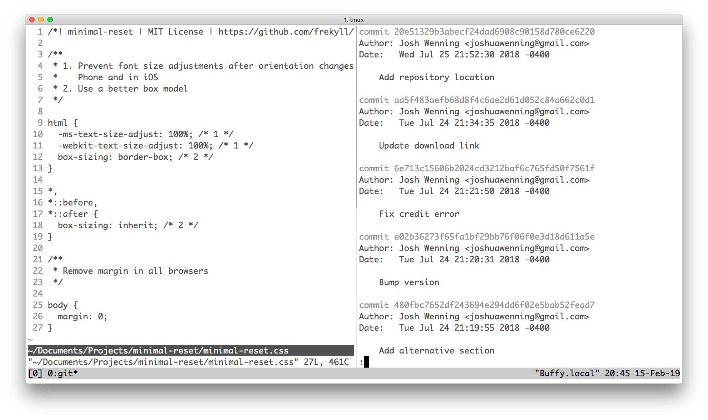

# iterm2-grayscale
> Minimal [iTerm2](https://www.iterm2.com/) theme using monochromic shades

## Install
- Right-click [`Grayscale.itermcolors`](https://github.com/frekyll/iterm2-grayscale/raw/master/Grayscale.itermcolors) and choose `Save Link As…`
- Double-click the downloaded file

## Tip
The screenshot is using a simple Bash promt, [tmux](https://github.com/tmux/tmux), and [Vim](https://github.com/vim/vim) with `syntax off`.

## License

MIT © [Frekyll](https://frekyll.com)
